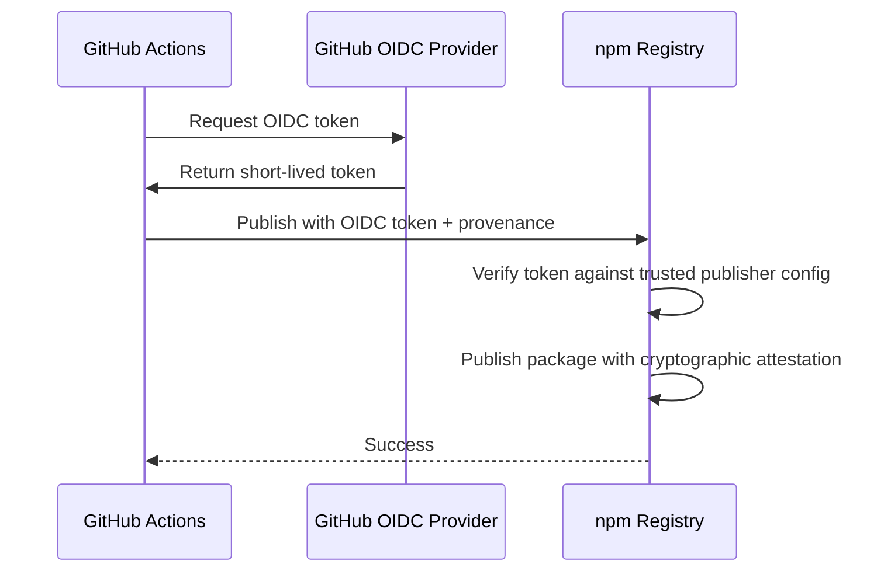

# npm Trusted Publishing Setup

This repository uses **npm's Trusted Publishing** via OpenID Connect (OIDC) for secure, token-free publishing from GitHub Actions.

## Benefits

✅ **No stored tokens** - Eliminates security risk of leaked tokens
✅ **Automatic rotation** - Short-lived OIDC tokens expire after use  
✅ **Provenance** - Cryptographically links published packages to source code
✅ **Compliant** - Meets npm's new security requirements (classic tokens deprecated Dec 2025)

## Setup Instructions

### 1. Configure npm Packages

For each package you want to publish (`@hummbl/core`, `@hummbl/mcp-server`):

1. **Login to npmjs.com**
2. **Navigate to package settings** (or create the package first via `npm publish --dry-run`)
3. **Go to "Publishing Access" → "Trusted Publishers"**
4. **Add GitHub Actions as a trusted publisher**:
   - **Provider**: GitHub Actions
   - **Repository Owner**: `hummbl-dev` (or your GitHub org/username)
   - **Repository Name**: `hummbl-monorepo`
   - **Workflow**: `publish-core.yml` (or `publish-mcp-server.yml`)
   - **Environment**: Leave blank (or specify if you use GitHub Environments)

### 2. Verify GitHub Actions Permissions

The workflows already have the required permissions:

```yaml
permissions:
  contents: read
  id-token: write # Required for OIDC token
```

### 3. No Secrets Needed!

~~Unlike classic tokens, you do NOT need to add `NPM_TOKEN` to GitHub secrets.~~ The workflow uses `secrets.GITHUB_TOKEN` which is automatically provided by GitHub Actions.

## Publishing Packages

### Option 1: Git Tags

Push a tag matching the pattern:

```bash
# For @hummbl/core
git tag @hummbl/core@1.0.0
git push origin @hummbl/core@1.0.0

# For @hummbl/mcp-server
git tag @hummbl/mcp-server@1.0.0-beta.3
git push origin @hummbl/mcp-server@1.0.0-beta.3
```

### Option 2: Manual Dispatch

1. Go to **Actions** tab in GitHub
2. Select **"Publish @hummbl/core"** or **"Publish @hummbl/mcp-server"**
3. Click **"Run workflow"**
4. Enter the version tag (e.g., `v1.0.0`)

## How It Works



## Troubleshooting

### Error: "403 Forbidden"

- **Cause**: Package not configured for trusted publishing
- **Fix**: Add GitHub Actions as a trusted publisher on npmjs.com (step 1 above)

### Error: "OIDC token validation failed"

- **Cause**: Mismatch between workflow path and npm config
- **Fix**: Ensure the workflow filename in npm matches the actual workflow file

### Error: "Package not found"

- **Cause**: Package doesn't exist on npm yet
- **Fix**: Run `npm publish --dry-run` locally first to initialize the package

## References

- [npm Trusted Publishing Documentation](https://docs.npmjs.com/generating-provenance-statements)
- [GitHub Actions OIDC](https://docs.github.com/en/actions/deployment/security-hardening-your-deployments/about-security-hardening-with-openid-connect)
- [npm Provenance](https://github.blog/2023-04-19-introducing-npm-package-provenance/)
