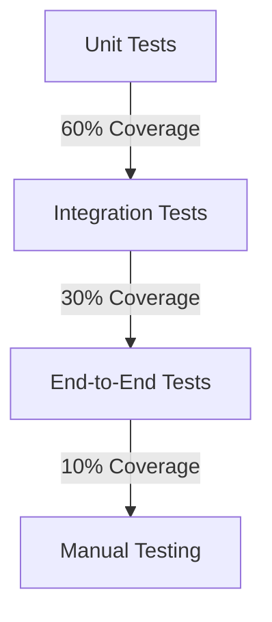

# Testing Strategy

## Overview
This document outlines the testing approach for HUMMBL models, ensuring consistency, reliability, and maintainability across all implementations.

## Testing Pyramid



## 1. Unit Testing

### Scope
- Individual model components
- Utility functions
- Helper methods

### Tools
- **Framework**: Jest
- **Assertions**: Jest + `@testing-library`
- **Mocks**: Jest Mocks
- **Coverage**: Istanbul

### Example: Model Unit Test

```typescript
describe('P1: First Principles', () => {
  let model: FirstPrinciplesModel;
  
  beforeEach(() => {
    model = createFirstPrinciplesModel();
  });
  
  it('should break down problems into fundamental truths', async () => {
    const result = await model.analyze({
      problem: 'Improve user engagement',
      context: 'Mobile app'
    });
    
    expect(result).toHaveProperty('fundamentals');
    expect(result.fundamentals.length).toBeGreaterThan(0);
    expect(result.assumptions).toBeDefined();
  });
});
```

## 2. Integration Testing

### Scope
- Model interactions
- Data flow between components
- External service integrations

### Tools
- **Framework**: Jest
- **Mocks**: `nock` for HTTP mocks
- **Fixtures**: Test data factories

### Example: Model Integration Test

```typescript
describe('Model Integration: P1 + IN1', () => {
  it('should combine first principles with inversion', async () => {
    const p1 = createFirstPrinciplesModel();
    const in1 = createInversionModel();
    
    const fundamentals = await p1.analyze('Reduce server costs');
    const inverted = await in1.invert(fundamentals);
    
    expect(inverted).toHaveProperty('invertedPrinciples');
    expect(inverted.invertedPrinciples.length).toBe(fundamentals.length);
  });
});
```

## 3. End-to-End Testing

### Scope
- Complete user flows
- API endpoints
- UI interactions

### Tools
- **Framework**: Cypress
- **Assertions**: Chai
- **Visual**: Percy.io

### Example: E2E Test

```typescript
describe('Model Exploration Flow', () => {
  it('should allow exploring related models', () => {
    cy.visit('/models/p1');
    cy.get('[data-testid="related-models"]').should('be.visible');
    cy.get('[data-testid="related-in1"]').click();
    cy.url().should('include', '/models/in1');
  });
});
```

## 4. Performance Testing

### Metrics
- Response times
- Memory usage
- CPU utilization
- Throughput

### Tools
- **Load Testing**: k6
- **Profiling**: Node.js built-in profiler
- **Monitoring**: Prometheus + Grafana

### Example: Load Test

```javascript
import http from 'k6/http';
import { check, sleep } from 'k6';

export const options = {
  vus: 10,
  duration: '30s',
  thresholds: {
    http_req_duration: ['p(95)<200'],
  },
};

export default function () {
  const res = http.post('https://api.hummbl.io/models/p1/analyze', {
    problem: 'Test problem',
    context: 'test'
  });
  
  check(res, {
    'status is 200': (r) => r.status === 200,
    'response time < 200ms': (r) => r.timings.duration < 200,
  });
  
  sleep(1);
}
```

## 5. Test Data Management

### Strategies
- **Factories**: Generate test data
- **Fixtures**: Pre-defined test cases
- **Fuzzing**: Random data generation

### Example: Test Factory

```typescript
const createTestProblem = (overrides = {}) => ({
  problem: 'How can we improve testing?',
  context: 'Software development',
  options: {
    maxDepth: 3,
    includeExamples: true,
  },
  ...overrides,
});
```

## 6. Continuous Testing

### Pipeline Integration
- **On Commit**: Unit tests
- **On PR**: Integration tests + Linting
- **On Merge**: Full test suite + E2E
- **Nightly**: Performance tests

### Tools
- **CI/CD**: GitHub Actions
- **Code Quality**: SonarQube
- **Coverage**: Codecov

## 7. Test Coverage

### Targets
- **Statements**: 90%+
- **Branches**: 85%+
- **Functions**: 90%+
- **Lines**: 90%+

### Reporting
- HTML reports
- Badges in README
- PR comments

## 8. Mutation Testing

### Purpose
- Validate test effectiveness
- Find untested code paths

### Tools
- StrykerJS
- Mutode

### Configuration
```javascript
// stryker.conf.js
module.exports = {
  packageManager: 'npm',
  reporters: ['html', 'clear-text', 'progress'],
  testRunner: 'jest',
  coverageAnalysis: 'perTest',
  mutate: [
    'src/models/**/*.ts',
    '!src/models/**/*.test.ts',
    '!src/models/**/index.ts',
  ],
};
```

## 9. Visual Regression Testing

### Tools
- Percy
- Applitools
- Storybook + Chromatic

### Implementation
```javascript
// In your test file
describe('Model Visualization', () => {
  it('should render model visualization correctly', () => {
    cy.visit('/models/p1');
    cy.percySnapshot('First Principles Model View');
  });
});
```

## 10. Security Testing

### Focus Areas
- Input validation
- Authentication/Authorization
- Data protection
- Dependency vulnerabilities

### Tools
- OWASP ZAP
- npm audit
- Snyk

## Test Environment

### Requirements
- Isolated test database
- Mock external services
- Consistent test data
- Clean state between tests

### Setup
```bash
# Install dependencies
npm install --save-dev jest @testing-library/react cypress @percy/cli

# Run tests
npm test              # Unit tests
npm run test:watch    # Watch mode
npm run test:cov      # Coverage report
npm run test:e2e      # E2E tests
npm run test:perf     # Performance tests
```

## Best Practices

1. **AAA Pattern**: Arrange, Act, Assert
2. **Test Isolation**: Each test should be independent
3. **Descriptive Names**: `should [expected behavior] when [state/input]`
4. **Minimal Mocks**: Only mock what's necessary
5. **Test Data**: Use factories for complex objects
6. **Edge Cases**: Test boundaries and error conditions
7. **Readability**: Clear test structure and assertions
8. **Performance**: Keep tests fast and efficient

## Review Process

1. **Code Review**: All tests must be reviewed
2. **Peer Testing**: Cross-team validation
3. **QA Sign-off**: Required for production release
4. **Retrospectives**: Continuous improvement
